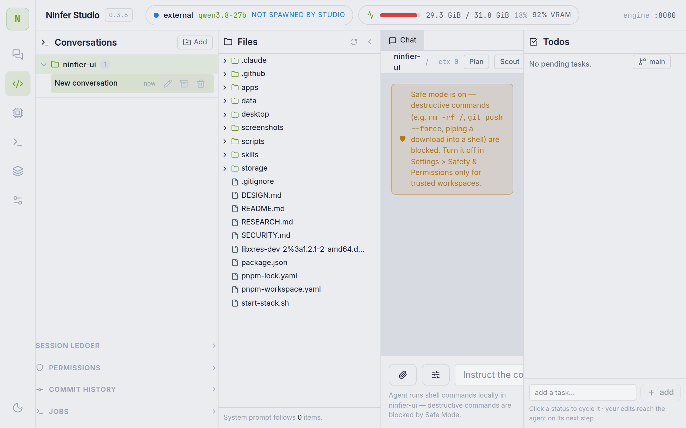

# NInfer Studio

A from-scratch, **native Linux & Windows desktop app** (Tauri 2 — WebKitGTK on
Linux, WebView2 on Windows) for the
[NInfer](https://github.com/Neroued/ninfer) local LLM inference engine — turning a raw
`ninfer-serve` binary into a product.

> NInfer Studio is the **desktop shell**: engine configuration with per-GPU presets,
> model management with Hugging Face downloads, streaming chat with vision, an agentic
> coding harness, and live token/throughput/VRAM metrics — with the control plane
> running in-process. The inference engine itself (`ninfer-serve`) is a separate
> project you point Studio at.

## Screenshots

| Chat | Engine |
|------|--------|
|  |  |
| **Models** | **Settings — Safety & Permissions** |
|  |  |
| **Coder** | |
|  | |

## Features

- **Engine configuration** — every `ninfer-serve` option as a labeled, documented
  control: context/KV capacity & dtype (`bf16` / `int8` / `fp8` / `nvfp4` / `k8v4`),
  concurrency, speculative decoding (MTP / DFlash / DFlash2), vision & media budgets,
  context-cache tiers, sampling defaults, logging — plus a live **generated launch
  command** and one-click **presets**, including RTX 5090 presets calibrated
  from the engine's own measured KV density across the registered artifacts
  (192k long-context MTP, 128k bf16, C=4 nvfp4 serving, 96k low-latency, 128k MoE,
  and two 256k ultra-context presets at the variants' full 262,144-token native
  window — k8v4 dual-lane and NVFP4 single-lane) plus a **community-validated**
  262k fp8 profile ported from `headpiece747/ninfer-5090-windows` (MTP5, prefill
  chunk 1024). The engine does no rope scaling, so `max_context` above a variant's
  native 262,144 fails at startup.
- **Community ecosystem** — the engine (`Neroued/ninfer`) has an active community:
  63 GitHub repos and ~20 Hugging Face `.ninfer` artifact repos. Notable forks add
  features upstream lacks (splickz's `rk4v4-e8` E8-lattice 4-bit KV with YaRN-style
  rope scaling for ~600k-token contexts; Azhu9701's NVMe disk cache and MTP7).
  Studio targets upstream and deliberately does not emit fork-only flags — they
  fail upstream validation. Upstream `--spec mtp` accepts draft tokens 1–5 only;
  dflash/dflash2 accept 1–15. At 262k context on a 32 GB card, keep
  `--max-concurrency` at 1–4 (community-verified: C=8 fails startup).
- **VRAM safety floor** — after load, Studio tails the engine's `capacity` log line
  (its own runtime/free VRAM accounting) and warns when free VRAM drops under the
  1.8 GiB safety floor, before an OOM can kill the run mid-generation. Works for
  adopted engines too.
- **Model management** — scans the models directory for downloaded `.ninfer` artifacts,
  shows the registered catalog with local/download states, and downloads artifacts from
  Hugging Face via the `hf` CLI. An optional **Hugging Face token** (masked in the UI,
  passed via the `HF_TOKEN` env var — never argv) unlocks faster, non-rate-limited
  downloads.
- **Chat** — streaming chat over the engine's OpenAI-compatible API: reasoning shown in
  a collapsible thinking block, per-message engine metrics (TTFT, prompt/decode tok/s,
  cached tokens, MTP draft acceptance), sampling/thinking overrides per conversation,
  image/video attachments rendered **inline in the transcript** (vision engines),
  model-emitted markdown images, live context-usage gauge (context window read straight
  from the engine, no manual `--max-context` bookkeeping), stop button, and persisted
  conversation history. Type `/compact` to ask the engine to condense the whole
  conversation into a structured checkpoint summary, which replaces the thread and
  becomes its starting context (handy before a context-limit warning).
- **Chat Agent Mode** (Settings > Agent, opt-in) — turns Chat into more of an agent:
  a **research** tool tier adds the sandboxed headless `browser` tool alongside
  web_fetch/web_search; a persistent cross-conversation **memory** bank the model can
  write to; a **Reflection** self-review pass (Generate → Reflect → Refine, bounded to
  one retry, with an independent critic-model override); and concurrency-gated **Deep
  research** that fans a question out into parallel research angles and synthesizes one
  answer. Tool calls route through the engine's `/v1/responses` transport when
  available. `browser`/`memory_update` each get an independent allow/ask/deny
  permission tier with a HITL approval dialog on `ask`.
- **Cloud Provider (hybrid local + cloud)** — bring-your-own-key access to any
  OpenAI-compatible endpoint (presets for OpenAI, OpenRouter, Groq, DeepSeek, Together
  AI, or a custom base URL), with independent **primary** and **subagent** model
  selection, live model-list retrieval + connection test, and per-role **Global
  Execution Routing** (force a surface to local/cloud regardless of the other's
  setting). Requests still route through the local proxy (`x-ninfer-base-url` /
  `x-ninfer-api-key` headers pick the target server-side) rather than the browser
  calling out directly. Automatic **fallback to the local engine** on a 429/5xx from
  the cloud endpoint, optional context pruning and a local compactor for
  cloud-context budgets, and concurrency-gated deep-research fan-out only parallelizes
  when the target is cloud (the local engine serves one lane at a time).
- **Computer Use (Chat, opt-in)** — gives a Chat conversation the same tool surface
  as Coder mode (file read/write/edit/patch, grep/glob, shell exec with jobs,
  git status/diff/branch/commit/PR, repo search) scoped to a chosen directory,
  gated by the same allow/ask/deny permission machinery and HITL approval dialog as
  the Agent Mode `browser`/`memory_update` tiers. Runs through the same coder
  endpoints as Coder mode, so it inherits that mode's sandbox/safe-mode protections
  (see [Security](#security)).
- **MCP tool servers** — connect external [Model Context Protocol](https://modelcontextprotocol.io)
  servers (stdio child process or streamable-HTTP) from Settings; their tools are
  discovered, cached, and exposed to the agent loop namespaced `mcp__<server>__<tool>`,
  under the same permission tiers as built-in tools. A dead or misconfigured server
  never takes the control plane down with it.
- **Usage & cost tracking** — every proxied chat request is logged; the Engine →
  Usage tab folds the log into daily totals split **local vs. remote**: tokens,
  cache-hit rate, and (for the local engine) GPU energy in kWh at a configurable
  price per kWh and currency symbol, plus per-model cloud $ cost from a cached
  OpenRouter-sourced pricing table.
- **Suggested follow-ups** — after a reply completes, Chat asks the model for three
  short, one-click next questions shown as chips under the reply.
- **Coder mode** — an agentic coding harness over the same engine: plan/act loop with
  file read/write/edit, grep/glob, shell exec with sessions and background jobs, git
  integration, **Scout / Verify / Critic** harness passes (opt-in, labeled, collapsible),
  worker/subagent delegation with depth and step budgets, conversation **checkpoints**
  with restore, human-approval (HITL) gates, sandboxed vs. live execution modes, and a
  per-workspace memory bank — with a live **prefill/decode indicator** so the model
  thinking is never invisible. Safe Mode, Sandbox, and Commit Approval live in
  Settings > Safety & Permissions (shared live across screens), with per-workspace
  tool permissions still in the Coder sidebar.
- **Tabbed Settings & Engine screens** — Settings splits into **Engine / Safety &
  Permissions / Agent / About**; Engine itself splits into **Basics / Performance /
  Advanced / Profiles** to cut down on scrolling through every `ninfer-serve` option
  at once. A default permissions template in Settings seeds new Coder workspaces
  without touching existing ones.
- **Engine supervision** — starts/stops `ninfer-serve` from the UI, adopts
  already-running engines (never double-spawns), tails the engine log, reports GPU
  state via `nvidia-smi`, and **stops a running engine before Rebuild** so a fresh
  binary can link cleanly.
- **Context-limit awareness** — the chat view shows live "% of max-context" usage and
  warns before the engine would truncate (approaching >75%, near-full >90%).
- **Desktop polish** — tray icon + **close-to-hide** (closing the window hides to the
  tray and keeps a spawned engine alive, rather than killing it), **single-instance**
  launch (a second launch focuses the existing window), and **native OS notifications**
  for engine ready/stopped, download finished, and build finished. Custom app icon
  across AppImage, Windows exe, and tray.
- **Hardened localhost API** — CORS is an explicit allow-list (Tauri webview + dev
  Vite) and foreign `Host` headers are rejected, closing the DNS-rebinding vector
  against the loopback control plane.
- **Per-user persistence** — app settings, the engine profile, saved named profiles, and
  chat conversations all persist to a per-user config dir (`~/.config/ninfier-studio` on
  Linux, `AppData/Roaming/ninfier-studio` on Windows) so they survive a restart and roam
  with the user's home. Override the location with `NINFIER_STUDIO_DATA`.

## Architecture

```
desktop/         Rust control plane + Tauri 2 desktop shell
  control/       ninfier-control: engine supervision, model scan, hf downloads,
                 coder endpoints, VRAM accounting, nvidia-smi stats, SSE-safe
                 engine API proxy, static hosting
  app/           ninfier-studio: Tauri 2 window hosting the control plane
apps/web         React 19 + Vite + Tailwind 4 frontend
                 (Chat / Coder / Engine / Models / Settings)
start-stack.sh   dev convenience: boot the control plane, seed config from env vars,
                 start/adopt the engine
~/.config/ninfier-studio/   per-user runtime state (CONFIG_HOME); AppData/Roaming/ninfier-studio
                 on Windows — config.json, profile.json, chats.json, last-start.json,
                 engine-<port>.log. Override location with NINFIER_STUDIO_DATA.
```

The **control plane** (`desktop/control`) is the only process that touches the
engine. In development it runs standalone (`pnpm control:start`); in the desktop
app it runs inside the Tauri core, so the engine's parent is the app itself — a
single process supervises the engine.

| API | Purpose |
|---|---|
| `GET /api/status` | engine state (incl. adopted external pids, max context window), GPU, VRAM accounting, models, downloads, config (secrets redacted) |
| `POST /api/engine/start` | profile + artifact → `ninfer-serve` argv; spawn, health-poll, log capture |
| `POST /api/engine/stop` | SIGTERM the child (8 s grace) or the adopted external pid |
| `POST /api/engine/update` | `pull` (git pull --ff-only) or `build` (stops a running engine first, then cmake/Ninja) |
| `GET /api/logs?n=400` | tail of the spawned engine's log |
| `GET /api/models` | scan `modelsDir` for `*.ninfer` + registered catalog |
| `POST /api/models/download` | `hf download <repo> <file> --local-dir` (uses `HF_TOKEN` when set) |
| `GET /api/gpu` | `nvidia-smi` memory/util/process list |
| `GET/POST /api/config` | app settings (config dir / config.json) |
| `GET/POST /api/profile-state` | engine profile, chosen artifact, saved named profiles (profile.json) |
| `GET/POST /api/conversations` | chat conversations + per-conversation params (chats.json) |
| `/api/coder/*` | coder harness: workspace, tree/dirs/read/write/edit/patch, grep/glob, exec + jobs, safe mode, memory, git diff/log |
| `GET /health`, `/v1/*` | SSE-safe proxy to the engine port (injects API key) — also the Cloud Provider proxy: `x-ninfer-base-url`/`x-ninfer-api-key`/`x-ninfer-extra-headers` request headers redirect a given call to a configured cloud endpoint instead of the local engine |
| `GET /api/usage`, `POST /api/usage/reset` | fold the request log into daily totals (local/remote split, cache-hit rate, GPU energy cost) for the Usage tab; reset clears the log |
| `GET/POST /api/mcp/servers`, `POST /api/mcp/servers/{name}`, `POST /api/mcp/servers/{name}/restart` | list/upsert/delete/restart configured MCP servers |
| `GET /api/mcp/tools`, `POST /api/mcp/call` | namespaced tool catalog across connected MCP servers; invoke one tool |

All state-changing endpoints accept only loopback `Host`/`Origin` values (browser
cross-origin calls are limited to the allow-listed Tauri/Vite origins) — see
[Security](#security).

## Prerequisites

- A built **NInfer** engine (`ninfer-serve`) and (for GPU stats) an NVIDIA driver +
  `nvidia-smi`. Point Studio at it via Settings (`ninferPath`, `modelsDir`).
- **Rust** toolchain (stable) and **Node ≥ 22 + pnpm** (only needed to build the web bundle).
- **Tauri 2 system dependencies** on Linux (Debian/Ubuntu):

  ```bash
  sudo apt-get install -y \
    libwebkit2gtk-4.1-dev libgtk-3-dev libjavascriptcoregtk-4.1-dev \
    libsoup-3.0-dev librsvg2-dev libayatana-appindicator3-dev
  ```

  > On some rolling/derivative distros the WebKit/GLib runtime and `-dev` packages can
  > drift out of sync (a `-dev` package wanting an older runtime). If `apt` refuses with
  > a version-skew error, allow the runtime downgrades:
  > `sudo apt-get install -y --allow-downgrades libwebkit2gtk-4.1-dev …`.
- Optional: the `hf` CLI for in-app model downloads, and `rg` (ripgrep) for the Coder
  repo-map.

## Build & Run

```bash
git clone <this-repo> && cd ninfier-ui
pnpm install && pnpm build          # build the web bundle → apps/web/dist
```

**Desktop app (debug):**

```bash
pnpm desktop:run                   # native WebKitGTK window (debug) on :8787
```

**Desktop app (release binary):**

```bash
pnpm desktop:build                 # cargo build --release (no tray feature)
# or with the tray icon:
pnpm desktop:build:tray            # adds --features tray (needs libayatana-appindicator3-dev)
desktop/target/release/ninfier-studio
```

**Bundled installer / portable image:**

```bash
pnpm desktop:bundle                # pnpm tauri build --features tray --bundles deb appimage
```

Produces `.deb` + `.AppImage` in `desktop/target/release/bundle/`.

**Development modes:**

```bash
pnpm dev            # Rust control plane :8787 + Vite :5173 (HMR browser UI)
pnpm control:start # headless: Rust control plane only, no window
pnpm desktop:run    # native window + Rust control plane (dist from apps/web/dist)
```

`NINFIER_STUDIO_DATA` overrides the per-user config dir (default
`~/.config/ninfier-studio` on Linux, `AppData/Roaming/ninfier-studio` on Windows) and
`NINFIER_STUDIO_DIST` (default `apps/web/dist`) overrides the dist location.

`start-stack.sh` (dev) boots the control plane and optionally seeds config + starts the
engine, taking all paths from the environment — `NINFER_DIR`, `MODELS_DIR`,
`CODER_WORKSPACE`, `ARTIFACT`, `ENGINE_PORT`; settings persist in `config.json`
after the first run.

## Packaging & CI Releases

`.github/workflows/release.yml` builds and releases on **ubuntu-24.04** (`.deb` +
`.AppImage`) and **windows-latest** (`.exe`/nsis) — a draft GitHub Release is created
and each platform uploads its artifact into it.

Trigger a release by pushing a version tag:

```bash
git tag v0.4.0 && git push origin v0.4.0
```

(or run the workflow manually from the Actions tab). Windows artifacts are currently
**unsigned** — expect a SmartScreen warning until code-signing is wired in.

## Configuration

Settings, the engine profile, saved profiles, and conversations all live in the
per-user config dir (default `~/.config/ninfier-studio` on Linux,
`AppData/Roaming/ninfier-studio` on Windows; override with `NINFIER_STUDIO_DATA`),
created on first save. Key files:

| File | Meaning |
|---|---|
| `config.json` | app settings — key fields below |
| `profile.json` | engine profile, chosen artifact, and saved named profiles |
| `chats.json` | chat conversations + per-conversation sampling/thinking params |
| `last-start.json` | last engine start record (dirty indicator for the Engine tab) |
| `engine-<port>.log` | tailed engine stdout/stderr (also the source of the VRAM capacity line) |

`config.json` key fields (camelCase as written by the app):

| Field | Default | Meaning |
|---|---|---|
| `ninferPath` | (none — set per machine) | NInfer checkout: `ninfer-serve` binary, CLI, git source |
| `modelsDir` | (none — set per machine) | directory scanned for `*.ninfer` artifacts |
| `enginePort` | `8080` | port the engine / proxy listens on |
| `apiKey` | (empty) | API key injected into proxied `/v1/*` requests |
| `hfCli` | `hf` | Hugging Face CLI binary |
| `hfToken` | (empty) | optional HF token for downloads; redacted to `********` in API responses |
| `buildCommand` | cmake/Ninja one-liner | engine rebuild command (Rebuild engine button) |
| `coderWorkspace` | (empty) | default Coder mode workspace |
| `coderSafeMode` | `true` | refuse a fixed set of clearly destructive shell command patterns |
| `coderSandbox` | (per-machine) | wrap the agent shell in the OS sandbox (bwrap on Linux, Job Object + low integrity on Windows) — workspace read-write, host read-only |
| `coderCommitApproval` | `false` | require explicit human sign-off before the agent commits |
| `remoteAccessEnabled` | `false` | serve the app on `0.0.0.0` instead of loopback-only (Settings — Safety & Permissions → Remote Access) |
| `remoteAccessPort` | `1337` | port the Remote Access listener binds when enabled |
| `chatComputerUseEnabled` | `false` | opt into Computer Use tools in Chat, scoped to `chatComputerUseDir` |
| `chatBrowserTier` / `chatMemoryToolTier` | `allow` | allow/ask/deny permission tier for the Agent Mode `browser` / `memory_update` tools |
| `cloudProviderEnabled` | `false` | route chat/coder requests to `cloudProviderBaseUrl` instead of the local engine |
| `cloudProviderBaseUrl` / `cloudProviderApiKey` | (none) | OpenAI-compatible endpoint + key; key is redacted to `********` in API responses like `hfToken` |
| `cloudProviderPrimaryModel` / `cloudProviderSubagentModel` | (none) | model id used for the main turn vs. subagent/worker calls |
| `cloudFallbackToLocal` | `true` | on a cloud 429/5xx, retry the same request against the local engine |
| `costPerKwh` / `currencySymbol` | `0.1` / `$` | price used to convert the local engine's measured GPU energy into a cost figure on the Usage tab |

## Security

By default, the control plane binds to loopback and validates every request's `Host`
and `Origin` against loopback names and the allow-listed Tauri/Vite origins — a
malicious website can neither call the API cross-origin nor rebind its DNS to
`127.0.0.1` to reach it. Secrets (the HF token) are never returned by the API: clients
see only a `********` mask, and writes of the mask preserve the stored value. Coder
file operations are confined to the configured workspace.

Turning on **Remote Access** (Settings — Safety & Permissions) opts out of that
loopback boundary on purpose: it binds a second, unauthenticated listener on
`0.0.0.0:<remoteAccessPort>` so another device on your network can open the same
live session (e.g. from a laptop). There is no login or token — anyone who can reach
that port gets the same agent access a local user has (shell, file writes, git, the
browser tool, and — if enabled — Chat's Computer Use and any configured MCP
servers). Only enable it on a network you trust; see [SECURITY.md](SECURITY.md)
for the full threat model.

See [SECURITY.md](SECURITY.md) for the vulnerability-reporting policy and the current
dependency/audit status.

## Further reading

- [RESEARCH.md](RESEARCH.md) — stack & reference-project research.
- [DESIGN.md](DESIGN.md) — full architecture, screen specs, option→control mapping,
  and the verification log.
