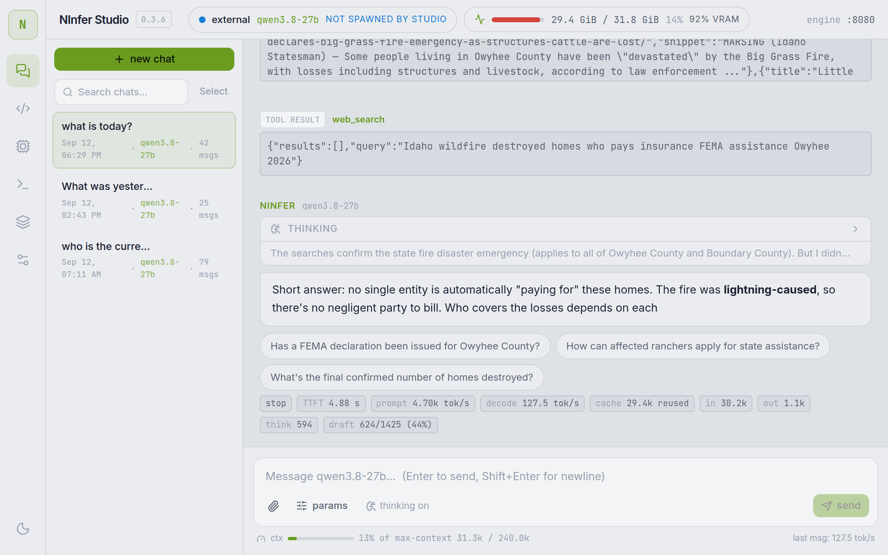
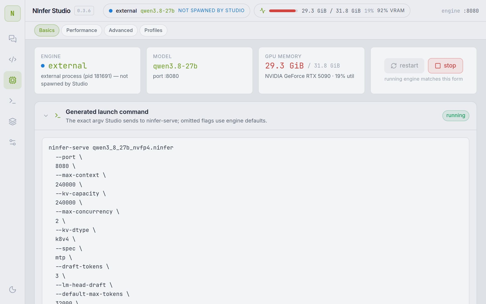
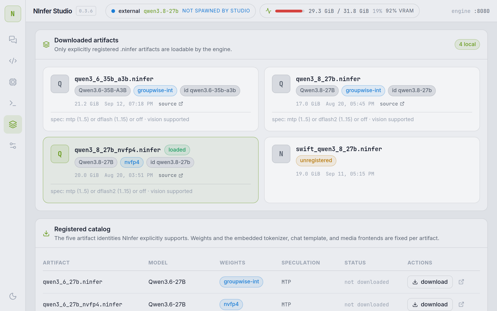
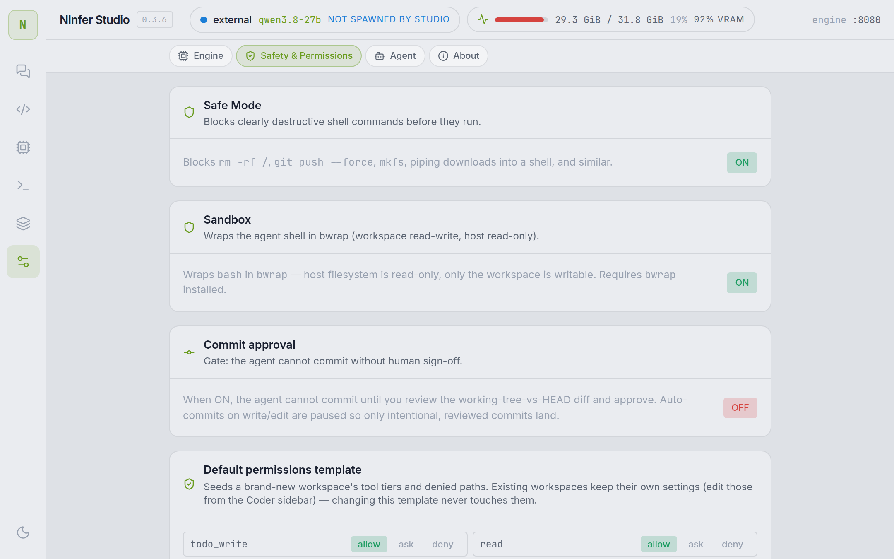

# NInfer Studio

A from-scratch, **native Linux desktop app** (Tauri 2 / WebKitGTK) for the
[NInfer](https://github.com/ninfer/ninfer) local LLM inference engine — turning a raw
`ninfer-serve` binary into a product.

> NInfer Studio is the **desktop shell**: engine configuration, model management,
> streaming chat, and live token/throughput metrics, with the control plane running
> in-process. The inference engine itself (`ninfer-serve`) is a separate project you
> point Studio at.

## Screenshots

| Chat | Engine |
|------|--------|
|  |  |
| **Models** | **Settings** |
|  |  |

## Features

- **Engine configuration** — every `ninfer-serve` option as a labeled, documented
  control: context/KV capacity & dtype, concurrency, speculative decoding
  (MTP / DFlash / DFlash2), vision & media budgets, context-cache tiers, sampling
  defaults, logging — plus one-click **presets** and a live **generated launch command**.
- **Model management** — scans the models directory for downloaded `.ninfer` artifacts,
  shows the registered catalog with local/download states, and downloads artifacts from
  Hugging Face via the `hf` CLI.
- **Chat** — streaming chat over the engine's OpenAI-compatible API: reasoning shown in
  a collapsible thinking block, per-message engine metrics (TTFT, prompt/decode tok/s,
  cached tokens, MTP draft acceptance), sampling/thinking overrides per conversation,
  image/video attachments (vision engines), stop button, local conversation history.
- **Engine supervision** — starts/stops `ninfer-serve` from the UI, adopts
  already-running engines (never double-spawns), tails the engine log, and reports GPU
  state via `nvidia-smi`.
- **Context-limit awareness** — the chat view shows live "% of max-context" usage and
  warns before the engine would truncate (approaching >75%, near-full >90%).
- **Desktop polish (Tier 3)** — tray icon + **close-to-hide** (closing the window hides
  to the tray and keeps a spawned engine alive, rather than killing it), **single-instance**
  launch (a second launch focuses the existing window), and **native OS notifications**
  for engine ready/stopped, download finished, and build finished.

## Architecture

```
desktop/         Rust control plane + Tauri 2 desktop shell
  control/       ninfier-control: engine supervision, model scan, hf downloads,
                 nvidia-smi stats, SSE-safe engine API proxy, static hosting
  app/           ninfier-studio: Tauri 2 window hosting the control plane
apps/web         React 19 + Vite + Tailwind 4 frontend (Chat / Engine / Models / Settings)
apps/sidecar     zero-dependency Node 22 dev-mode server implementing the same control-plane API
data/            runtime state (config.json, engine-<port>.log) — gitignored
```

The **control plane** (`desktop/control`, or `apps/sidecar` in browser dev mode) is the
only process that touches the engine. In the desktop app it runs inside the Tauri core,
so the engine's parent is the app itself — a single process supervises the engine.

| API | Purpose |
|---|---|
| `GET /api/status` | engine state (incl. adopted external pids), GPU, models, downloads, config |
| `POST /api/engine/start` | profile + artifact → `ninfer-serve` argv; spawn, health-poll, log capture |
| `POST /api/engine/stop` | SIGTERM the child (8 s grace) or the adopted external pid |
| `POST /api/engine/update` | `pull` (git pull --ff-only) or `build` (cmake/Ninja) the engine repo |
| `GET /api/logs?n=400` | tail of the spawned engine's log |
| `GET /api/models` | scan `modelsDir` for `*.ninfer` + registered catalog |
| `POST /api/models/download` | `hf download <repo> <file> --local-dir` |
| `GET /api/gpu` | `nvidia-smi` memory/util/process list |
| `GET/POST /api/config` | app settings (`data/config.json`) |
| `GET /health`, `/v1/*` | SSE-safe proxy to the engine port (injects API key) |

## Prerequisites

- A built **NInfer** engine (`ninfer-serve`) and (for GPU stats) an NVIDIA driver +
  `nvidia-smi`. Point Studio at it via Settings or `data/config.json`
  (`engine_binary`, `models_dir`).
- **Rust** toolchain (stable) and **Node ≥ 22 + pnpm** (only needed to build the web bundle).
- **Tauri 2 system dependencies** on Linux (Debian/Ubuntu):

  ```bash
  sudo apt-get install -y \
    libwebkit2gtk-4.1-dev libgtk-3-dev libjavascriptcoregtk-4.1-dev \
    libsoup-3.0-dev librsvg2-dev libayatana-appindicator3-dev
  ```

  > On some rolling/derivative distros the WebKit/GLib runtime and `-dev` packages can
  > drift out of sync (a `-dev` package wanting an older runtime). If `apt` refuses with
  > a version-skew error, allow the runtime downgrades:
  > `sudo apt-get install -y --allow-downgrades libwebkit2gtk-4.1-dev …`.

## Build & Run

```bash
git clone <this-repo> && cd ninfier-ui
pnpm install && pnpm build          # build the web bundle → apps/web/dist
```

**Desktop app (debug):**

```bash
pnpm desktop:run                   # native WebKitGTK window (debug) on :8787
```

**Desktop app (release binary):**

```bash
pnpm desktop:build                 # cargo build --release (no tray feature)
# or with the tray icon:
pnpm desktop:build:tray            # adds --features tray (needs libayatana-appindicator3-dev)
desktop/target/release/ninfier-studio
```

**Bundled installer / portable image:**

```bash
pnpm desktop:bundle                # pnpm tauri build --features tray --bundles deb appimage
```

Produces `.deb` + `.AppImage` in `desktop/target/release/bundle/`.

**Development modes:**

```bash
pnpm dev            # web dev: Vite :5173 (HMR) + Node sidecar :8787 (browser UI)
pnpm control:run    # headless: Rust control plane only, no window
pnpm desktop:run    # native window + Rust control plane (dist from apps/web/dist)
```

`NINFIER_STUDIO_DATA` (default `./data`) and `NINFIER_STUDIO_DIST` (default
`apps/web/dist`) override the data/dist locations.

## Packaging & CI Releases

`.github/workflows/release.yml` builds and releases on **ubuntu-24.04** (`.deb` +
`.AppImage`) and **windows-latest** (`.exe`/nsis) — a draft GitHub Release is created
and each platform uploads its artifact into it.

Trigger a release by pushing a version tag:

```bash
git tag v0.1.0 && git push origin v0.1.0
```

(or run the workflow manually from the Actions tab). Windows artifacts are currently
**unsigned** — expect a SmartScreen warning until code-signing is wired in.

## Configuration

Settings live in `data/config.json` (created on first save). Key fields:

| Field | Default | Meaning |
|---|---|---|
| `engine_binary` | (none — set per machine) | path to `ninfer-serve` |
| `models_dir` | (none — set per machine) | directory scanned for `*.ninfer` |
| `engine_port` | `8080` | port the engine / proxy listens on |

## Security

See [SECURITY.md](SECURITY.md) for the vulnerability-reporting policy and the current
dependency/audit status (JS deps clean; the Rust advisories are all transitive via
Tauri and tracked upstream).

## Further reading

- [RESEARCH.md](RESEARCH.md) — stack & reference-project research.
- [DESIGN.md](DESIGN.md) — full architecture, screen specs, option→control mapping,
  and the verification log.
